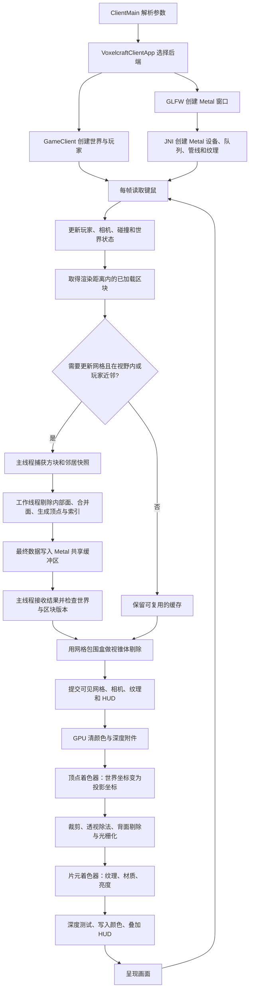
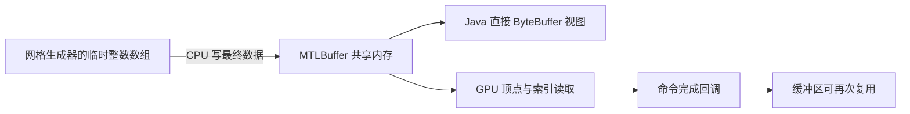

# Metal 共享内存与渲染流程

Metal 是可选后端，使用 Apple 统一内存中的 `MTLStorageModeShared` 顶点与索引缓冲区。
Java 通过 JNI 获得 `MTLBuffer.contents` 对应的直接 `ByteBuffer`，网格生成器把最终数据写入其中，GPU 绘制时读取同一个缓冲区。
现有 OpenGL 与软件后端继续可用，默认启动方式仍采用原有选择逻辑。

## 启动与验证

需要 macOS、支持统一内存的 Metal GPU、JDK 21 和 Xcode Command Line Tools。
本机已验证设备为 Apple M1 Pro。构建会编译 Objective-C JNI 桥接库并打包进客户端资源；产物对应构建机器的 CPU 架构。

```bash
./gradlew :client:runMetal
./gradlew :client:runMetalLocal
./gradlew check :client:metalTest :client:runHeadless
```

`metalTest` 使用真实 Metal 设备进行离屏渲染，并开启 Metal API Validation。
它验证共享内存修改能被 GPU 读取、深度遮挡、HUD 方向与缩放、缓冲区复用、现有网格生成器、相机转身、世界切换和关闭时的资源回收。
结果图片位于 `client/build/metal-test/`。
`./gradlew :client:runMetal -Dvc.smoke.frames=240` 会在绘制指定帧数后自动退出，方便窗口冒烟验证。

## 从启动到屏幕



图中的片元着色与深度测试是逻辑关系；硬件可能提前进行深度测试，减少不需要的片元着色。
多人模式中，网络收到的区块与方块修改进入客户端世界，再走相同的快照和网格更新路径。

## 共享内存与同步



共享的是同一个原生分配；`ByteBuffer` 是 CPU 访问它的视图。几何路径没有单独的 staging-buffer 到 GPU-buffer 上传步骤。
网格生成器仍使用临时数组，并将最终顶点与索引复制进共享缓冲区；HUD 也仍先由 Java2D 生成像素，再写入共享缓冲区。纹理初始化另有数据传入步骤。因此 `meshUploadCopies=0` 只描述网格上传路径，不代表整个程序没有任何复制。

CPU 完成写入并发布网格结果后，主线程才提交 GPU 命令。每个正在被 GPU 使用的缓冲区都有读取计数；命令完成回调减少计数。池只复用计数为零的缓冲区，命令同时持有原生资源引用，防止释放缓存时提前销毁资源。最多允许三帧 GPU 命令在途，避免 CPU 无限提交。

## 只渲染画面中的内容

- OpenGL 与 Metal 都会根据相机视锥体跳过画面外的区块绘制。
- Metal 现在会暂缓远处视野外区块的快照捕获与网格构建；玩家所在区块周围一圈仍允许提前构建，转身后新进入视野的区块会重新获得构建机会。
- 网格生成器剔除方块间的内部面，并合并可合并的面；GPU 做背面剔除和深度测试。
- 视锥体剔除采用保守的包围盒测试：部分进入视野的区块仍会提交，GPU 继续裁剪三角形。
- Metal 尚未增加整区块的遮挡查询或层次深度遮挡剔除。在视野内但被山挡住的区块仍可能提交顶点。深度测试保证遮挡结果，但不会免除所有前面的工作。
- 世界数据继续用于碰撞、邻接面判断与游戏逻辑。渲染剔除不会删除世界中的方块。镜头快速转向远处新区域时，异步网格仍可能需要短暂准备时间。

## 代码入口与性能边界

- `runtime/GpuClientRuntime.java`：共用窗口、输入和主循环，通过 `ClientGpuRenderer` 调用 OpenGL 或 Metal。
- `render/MetalChunkRenderer.java`：可见性、网格任务、缓存和每帧提交。
- `render/ChunkMesher.java`：共用的体素网格生成器。
- `render/MetalSharedBuffers.java`：共享分配、池与复用限制。
- `render/MetalNative.java` / `src/main/native/metal/MetalBridge.m`：JNI 与 Metal 命令编码、资源和同步。
- `src/main/resources/shaders/voxelcraft.metal`：相机投影、材质与 HUD 着色器。
- `render/BlockTextureAtlas.java`：OpenGL 与 Metal 共用的纹理图集构建。

共享缓冲区减少了一类复制，不保证总帧率一定提高。世界生成、主线程快照、网格构建、Java2D HUD、绘制调用和 GPU 像素负载都可能成为瓶颈。
比较 Java/C++ 或 OpenGL/Metal 时应固定设备、世界、相机轨迹、分辨率、渲染距离、LOD 和垂直同步，预热后记录帧时间及 p95/p99，并分开观察 CPU 与 GPU 时间。代码行数不能代替这些测量。

OpenGL 逐区块剔除日志默认关闭，避免每帧大量格式化与终端输出。排查剔除问题时可使用 `./gradlew :client:runGpu -Dvc.gpu.logChunkCull=true` 开启；原有帧性能和能力诊断日志不受影响。

Apple 共享资源说明：[MTLStorageMode.shared](https://developer.apple.com/documentation/metal/mtlstoragemode/shared)。
