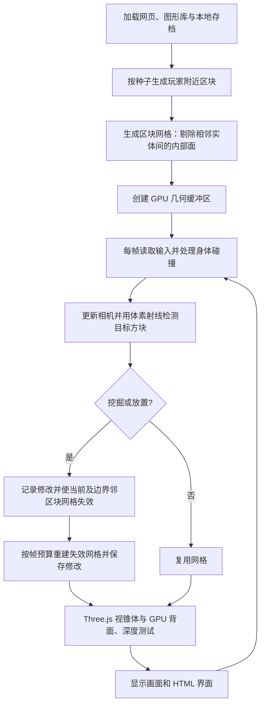

# Voxelcraft 网页客户端

网页客户端位于 `web/`，是可直接在浏览器运行的单人方块沙盒。

已发布地址：[Voxelcraft 网页版](https://voxelcraft-browser.zesty-ape-8343.chatgpt.site)，当前仅所有者可访问。
它使用 JavaScript、Three.js 0.180.0 和 WebGL 2。图形库已随网页打包，运行时不使用外部 CDN，也不需要 Java、Metal 原生库或 npm 安装。
本地预览和检查需要 Node.js 20 或更新版本。

```bash
npm --prefix web start
# 在浏览器中打开 http://127.0.0.1:4173

npm --prefix web run check
```

## 可用功能

- 按种子生成起伏地形与跨区块树木，移动时加载周围区块，卸载远处区块。
- 第一人称移动、重力、跳跃、身体碰撞和防止放置方块卡住玩家。
- 六米内选择、挖掘和放置方块；草、泥土、石头、橡木、树叶、沙子与砖块共七种材料。
- 快捷栏、滚轮选材、坐标、绘制数量与帧率显示。
- 视野距离切换、白昼与黄昏切换、暂停菜单。
- 自动保存种子、方块修改、玩家位置与视角；支持 JSON 存档导入导出。
- 窄屏布局与触屏方向、跳跃、挖掘、放置按钮，拖动画面调整视角。

## 操作

- `W/A/S/D` 移动，`Shift` 加速，`Space` 跳跃。
- 鼠标环顾；浏览器不允许锁定鼠标时，可以按住画面拖动或使用方向键。
- 左键挖掘、右键放置，也可以使用 `E/F`。
- `1–7`、滚轮或点击快捷栏选择材料。
- `Esc` 返回菜单，窗口失焦或页面进入后台时自动暂停。
- 触屏设备拖动世界画面环顾，使用屏幕上的操作按钮。

浏览器存档只属于当前浏览器、当前网站地址。清理网站数据、更换浏览器或从本地地址切换到线上地址不会自动迁移存档，可使用导出与导入转移。隐私模式或存储配额限制可能使自动保存失败，界面会提示导出备份。导入和新建世界会要求确认替换当前世界。

## 与桌面版的关系

网页使用独立的世界生成和存档格式，当前并不是 Java 程序的完整移植，也不能直接导入桌面存档。
目前未接入桌面 TCP 多人协议、完整方块注册表、W 轴切片与传送门、导弹等机制。保留这些边界可以让第一版无需安装即可完整运行单人建造循环。
浏览器不能直接运行 JNI/Metal 桥接代码，也不会把 Java 堆直接交给 GPU。本版通过 WebGL 2 提交区块网格。

## 渲染与性能



每个区块使用一个合并后的网格，避免逐方块提交绘制。网格生成剔除内部面；Three.js 默认视锥体剔除跳过视野外网格，GPU 做背面剔除与深度测试。加载和网格重建每帧都有数量与时间预算，远处区块卸载时释放几何 GPU 资源。
首版网格构建在主线程执行，没有移植桌面版的工作线程与贪心面合并。大型视野或低性能设备上可选择较短视野，后续可根据测量加入 Web Worker 和面合并。

## 文件

- `web/dist/index.html` / `style.css`：启动菜单、HUD、快捷栏与响应式布局。
- `web/dist/game.js`：图形资源、主循环、区块调度、输入、存档和界面。
- `web/dist/world.js`：纯世界逻辑、网格构建、射线和身体碰撞。
- `web/tests/world.test.mjs`：确定性生成、跨区块修改、存档往返、射线、网格绕序、碰撞与非法输入测试。
- `web/serve.mjs`：只监听本机地址的静态预览服务。
- `web/dist/vendor/`：固定版本 Three.js 模块与 MIT 许可证。
- `web/.openai/hosting.json`：私有 Sites 部署配置，静态目录为 `dist`。

可将 `web/dist/` 部署到支持 ES 模块的静态网站服务。首次 Sites 发布默认仅所有者可访问；公开分享权限需要另行调整。
