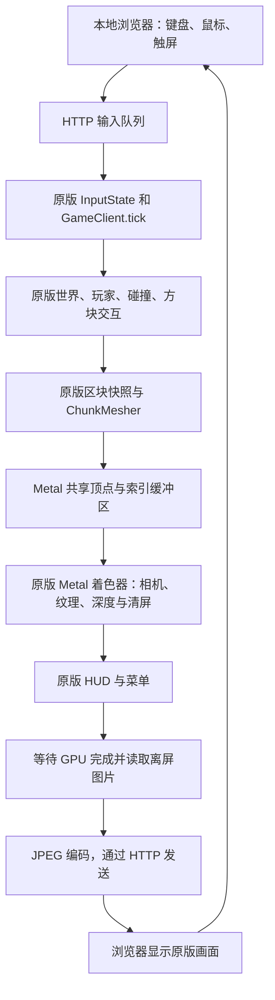

# 在本地浏览器中使用原版 Java 客户端

这里是原版 Java 游戏的浏览器显示与输入入口。浏览器没有自己的世界生成、物理、方块注册表、存档或游戏 HUD；这些仍由 `GameClient` 及原有模块负责。之前独立的 JavaScript 沙盒和重新设计的启动页面已从此入口移除。

## 启动

需要 JDK 17 或更新版本；Apple Silicon 上编译 Metal JNI 还需要 Xcode Command Line Tools，和原版 Metal 客户端一样。

```bash
./gradlew :client:runBrowser
# 打开 http://127.0.0.1:4173

# 兼容之前的启动命令，需要 Node.js：
npm --prefix web start

# 连接原有本地多人服务器：
./gradlew :client:runBrowser -Pconnect=127.0.0.1:25565
```

Apple Silicon 默认使用已有 `MetalChunkRenderer`，在离屏目标上渲染原版世界和原版 Java2D HUD。其他系统默认使用已有 Java2D 软件渲染；这条路径的性能不能代表 GPU 后端。可用 `-Dvc.browser.renderer=software` 明确选择软件模式。

浏览器直接显示 Java 渲染的图片，页面仅提供输入转发和连接状态。桌面点击画面锁定鼠标，WASD 移动、Space 跳跃、Shift 加速、1–7 选快捷栏、E 打开原版方块选择器、O 打开原版设置。Esc 释放鼠标或关闭原版面板。触屏使用左下方向按钮、右下跳跃/挖掘/放置按钮，拖动画面环顾；原版菜单打开后，触屏点击映射到菜单坐标。触屏按键只是对原有输入的映射，不改变游戏规则。

## 手机与 iPad

默认只监听当前电脑的 `127.0.0.1`。要让同一可信局域网中的手机/iPad 使用这台电脑运行的原版游戏：

```bash
./gradlew -Dvc.browser.host=0.0.0.0 :client:runBrowser
```

在设备浏览器打开 `http://电脑的局域网IP:4173`。Java 和 Metal 在电脑上运行，手机/iPad 接收画面并转发输入，不需要安装 Java。电脑必须持续运行服务，防火墙需要允许该端口。此入口无账号认证，不适合直接暴露到公网；多个浏览器会控制同一个玩家。

## 工作流程与性能边界



共享顶点缓冲区免除专门的网格上传，但不会免除世界生成、区块快照、网格构建、HUD 绘制、GPU 工作或同步。浏览器入口额外增加图片读回、颜色转换、JPEG 编码、传输与解码，不能把它当成提升原版帧率的方案。要测原版渲染性能，应使用 `:client:runMetal`，避免混入这些显示成本。

Metal 的主线程快照提交默认采用 4 毫秒软预算（`vc.metal.snapshotBudgetMs`）：每帧至少允许一份快照，超过预算后推迟后续快照；单份快照无法中途打断，因此实际值仍可能超过预算。该改动也作用于原生 Metal 窗口。

默认画面为 960×540，上限 30 FPS。可用 `vc.browser.width`、`vc.browser.height`、`vc.browser.fps` 调整；帧率参数只控制上限，实际速度仍取决于耗时。直接缓冲区和 RGB 图片在循环中复用；没有浏览器请求时暂停更新和渲染，失焦或输入心跳超时释放按键。

`http://127.0.0.1:4173/status` 返回实际后端、帧数、原版相机角度/快捷栏以及本帧阶段计时。`tickMs` 包含世界/玩家更新；`meshSnapshotSubmitMs` 是 `renderSubmitMs` 的一部分，不应重复相加；`readbackConvertMs` 包含 GPU 完成等待和像素转换；`jpegMs` 是编码时间。`workMs` 不含浏览器解码和网络传输，也不含帧率上限的等待时间。阶段值是当帧样本，不是平均值或 GPU 时间戳测量。

## GitHub Pages 的边界

GitHub Pages 只能托管静态网页，不能运行这个 Java/Metal 进程。把此入口上传到 Pages 不会让原版游戏自动运行，也无法通过 Pages 代替本地服务。已有 Pages 工作流改为只接受手动触发，不会因这次本地修改自动发布。需要公网使用时，应单独设计运行 Java 后端的服务器及安全连接。

之前发布的独立网页不是这个原版入口。本次没有更新远程 Sites 或 GitHub Pages；本地正确入口以运行命令输出的地址为准。

## 代码与检查

- `client/src/main/java/dev/voxelcraft/client/browser/BrowserClientMain.java`：原版 Java 运行循环、HTTP 图片与输入传输、阶段计时。
- `web/dist/index.html`、`style.css`、`game.js`：图片显示、鼠标锁定及触屏/键盘输入转发。
- `web/serve.mjs`：调用原版 Gradle 任务，保留 `npm --prefix web start` 命令。

```bash
npm --prefix web run check
./gradlew :client:test
./gradlew :client:metalTest
# Java 浏览器服务运行期间：
npm --prefix web run test:integration
```
